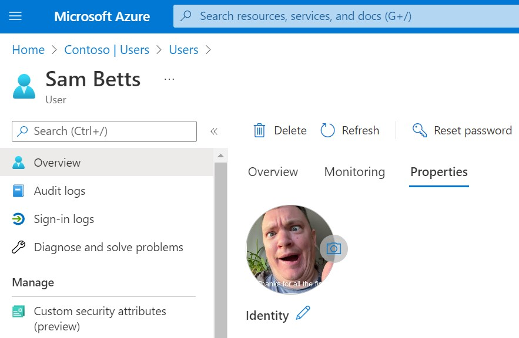
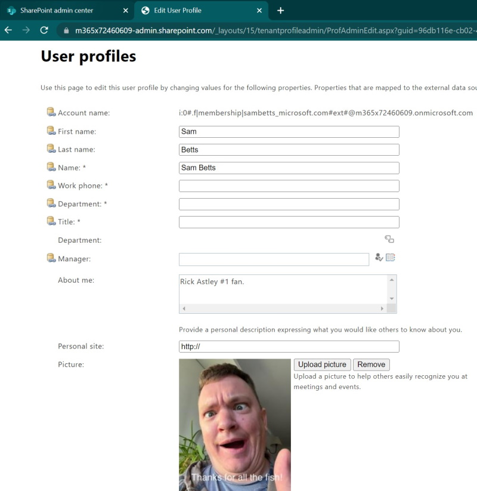

# SPO External User Image Sync Tool
Sync external user images from Azure AD to SharePoint Online. External user photos aren't synced out of the box, but this app will do it for you.

SPExternalUserImageSync looks for any external user in the configured Azure and will then update the SharePoint Online profile picture for any user without one, each time it’s run. The profile picture is taken from Azure AD so there are no dependencies on Exchange. 

Users are updated only if the following is true:
*	The user is a guest in the tenant.
*	There is an image in Azure AD for the guest user.
*	There is not an image in SharePoint Online for the user.

It can be run in “simulation mode” so it pretends to update the any users that fit the criteria – highly recommended for the 1st run at least.

In this example I'm a guest in tenant "m365x72460609":


Running the app will copy my image to my SPO user profile:



It could easily be adapated to run as a Function app to run on certain events/schedule too.
## Steps needed to Setup
We need x2 app identities created as there is a design limitation that only updates to “other” profiles can be done programmatically with SharePoint App-Only authentication. 
So, one app is to allow profile updates and the other app is to allow us to read Graph users.

### SharePoint App-Only setup
*	Follow guide @ https://docs.microsoft.com/en-us/sharepoint/dev/solution-guidance/security-apponly-azureacs
*	Note down client ID & secret of created app.
*	When you get to “Setting up an app-only principal with tenant permissions”, the permissions XML you need is (see https://github.com/pnp/powershell/issues/277):

```xml
<AppPermissionRequests AllowAppOnlyPolicy="true">
  <AppPermissionRequest Scope=http://sharepoint/content/tenant Right="FullControl" />
  <AppPermissionRequest Scope=http://sharepoint/social/tenant Right="FullControl" />
</AppPermissionRequests>
```

*	Create tenant app & have SPO admin trust identity.
*	Maybe needed: disable “DisableCustomAppAuthentication” with PowerShell cmd:

```PowerShell
Set-SPOTenant -DisableCustomAppAuthentication $false
```

### Graph App setup
*	Create an application registration in Azure with a client secret & the permission “User.Read.All”.
*	Grant admin consent to permission.

## Configuration Needed
This configuration should be added to a “appsettings.json” file in the same directory as the executable. Example file is given in “appsettings - template.json”.

Name | Example Value | Description
--- | ---- | ----
AzureAd:TenantId | "15af29f3-70b5-4083-ad6e-4ac5563c4aee" | Graph enabled app. 
AzureAd:Secret | "IUwxXXXXXXXXXXX" | Graph enabled app.
AzureAd:ClientID | "ed7ebe29-59ec-4608-ba29-0db99b6fe6d2" | Graph enabled app.
SPClientID | "879abfd9-cab9-493b-a616-c81f3f3b61c5" | SharePoint App-Only auth details.
SPSecret | "RaawxXXXXXXXXXXX" | SharePoint App-Only auth details.
TenantName | "contoso" | your org tenant name – “contoso” for example (contoso.onmicrosoft.com).
SimulateSPOUpdatesOnly | true | Write updates to SPO or just pretend. Highly recommended to set to “true” to start.
AppInsightsInstrumentationKey | "76da79c3-5381-4930-bbda-f6e8dc406b6e" | Optional (but recommended). Application Insights instrumentation key for logging.

If any of these values are blank the app will crash on start-up.
## Setup Instructions
Download the source and build the solution. If testing locally, create a “appsettings.json” from “appsettings - template.json” and fill in the configuration needed. 

If testing from Visual Studio 2022, you can also use a secrets file. 
